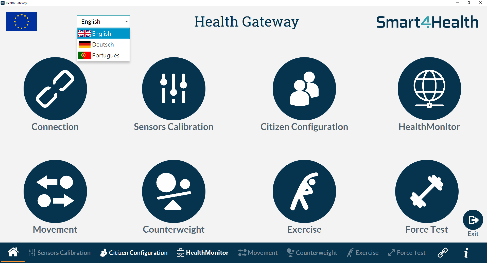

# Health Gateway

## Acknowledgements


This project has received funding from the European Union's Horizon 2020 research and innovation programme under grant agreement No 826117.

## About this app


The Health Gateway allows the real-time visualization of the MedX physiotherapy machine sensors' values, provides the MedX therapist with some functionalities, and assists the citizen during the MedX training.

The Health Gateway was built within the Smart4Health project and works together with the B-Health IoT Box (data acquisition system) and the HealthMonitor software (user management and training)



## Requirements

### Libraries

The Health Gateway depends on the following java libraries
- JavaFx 13
- Logback 1.2.3
- Slf4j api 1.7.28
- Paho Client Mqttv3 1.2.1
- Gson 2.8.5
- Medusa 8.3

### Config file

You need to provide the configuration file `HealthGatewayConfig.proprieties` in the woorking directory with the following information: 

```
logging_level=<degub, info, warn or error>
mqtt_subscribe_topics=<Subscribe MQTT topics to communicate with B-Health Iot Box>
mqtt_publish_topic=<Publish MQTT topics to communicate with B-Health Iot Box>
mqtt_publish_interval=<Publish interval of MQTT>
mqtt_broker_url=<URL of the MQTT>
mqtt_client_id=<ID of MQTT>
ittm_host=<URL of HealthMonitor>
ittm_machine_id=<ID of MedX machine>
hub_sensorization=<false or true>
load_cell=<2mv or 4mv>
box_host=<API for retrive trainnings>
```